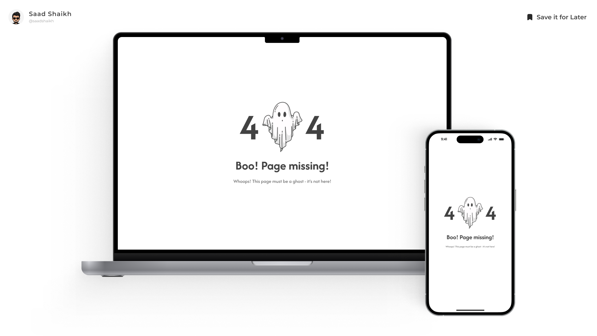

# 404-Page



**404-Page** is a clean, modern, and responsive 404 error page built with **React**, **Tailwind CSS**, and **JavaScript**. It improves user experience by providing a stylish and informative interface when users visit broken or missing links on your website.

---

## 🚀 Live Preview

- **[Live Preview](https://boo-404.vercel.app/)**
  <br>See the 404-Page in action.

## 🎨 Figma UI Inspiration

- **[Figma Design File](https://www.figma.com/community/file/1381562385964018425/08-daily-ui-challenge-404-page)**
  <br>Check out and remix the original design prototype.

---

## ✨ Features

- **Clean & Minimal UI**: Modern, visually appealing layout that clearly communicates the 404 error.
- **Responsive Design**: Optimized for mobile and desktop screens.
- **Animated Elements**: Smooth transitions and effects using Tailwind and CSS animations.
- **Customizable**: Easily edit the text, imagery, and styles to fit your brand.
- **Accessible Design**: Built with semantic HTML and accessibility best practices.

---

## 🛠️ Technologies Used

- **HTML**
- **CSS**
- **JavaScript**
- **React**
- **Tailwind CSS**

---

## ⚡ Installation

To run this project locally:

1. **Clone the repository:**
    ```bash
    git clone https://github.com/saad-shaikh-256/404-Page.git
    ```

2. **Navigate to the project folder:**
    ```bash
    cd 404-Page
    ```

3. **Install dependencies:**
    ```bash
    npm install
    ```

4. **Start the development server:**
    ```bash
    npm run dev
    ```

5. **Open [http://localhost:5173](http://localhost:5173) in your browser.**

---

## 📝 Notes

- This is a **standalone 404 error page** and can be integrated into any web app or site.
- Add it to your routing logic (e.g., React Router) to catch undefined routes.
- Replace the default image, error code, or message to match your brand.

---

## 🚧 Future Enhancements

- Toggle for enabling/disabling animations
- Multiple themed 404 pages (fun, minimal, illustrated, etc.)
- Redirect button with dynamic return logic
- Dark mode toggle

---

## 🙌 Credits

- **UI Design Inspiration:** [Figma Community File](https://www.figma.com/community/file/1381562385964018425/08-daily-ui-challenge-404-page)
- **Designed & Developed by [Saad Shaikh](https://saad-shaikh.vercel.app/)**

---

Feel free to suggest features, report bugs, or fork the project!
